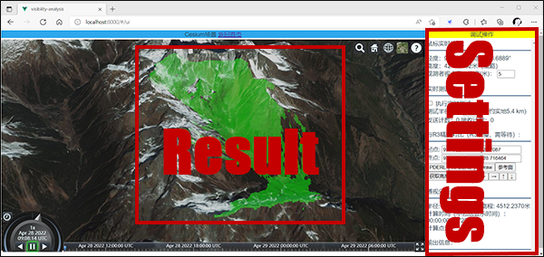
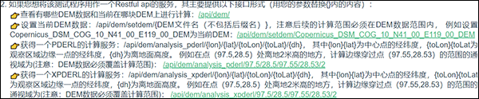

语言/Language: [中文](#项目介绍)/[English](#project-introduction)

# 项目介绍
该项目是PDERL和XPDERL算法的测试程序，以Restful WebAPI的形式提供了一个测试页面。项目在.net core 2.1框架下采用c# vs2019开发。

基于规则网格数字高程模型(DEM)的视域分析是地理信息系统的基本功能之一。传统的视域分析算法主要是在地理空间坐标系中进行的，当需要准确计算通视域时会面临原理简单但计算量巨大的问题，只能通过使用近似方法来减少计算量，但这是以牺牲精度为代价的。虽然近似算法（比如XDraw、R2、参考面算法）的错误率低，但错误点分布不均匀，极有可能造成连续的区域性计算错误。尽管近十年来DEM数据的质量有了显著的提高，但传统的近似算法已经无法充分利用现代DEM的精度优势。

PDERL和XPDERL建立了“临近度-方向-俯仰度”(PDE)坐标系，并在精度和速度上得到了很大的提高。实验证明，PDERL算法的精度与R3算法相同，速度大约是XDraw和参考平面算法的一半，但远快于R3算法。XPDERL的计算速度在高空比较稳定，略快于XDraw，略慢于参考平面算法；然而，在离地面较低的高度，它比两者都要快得多，尤其是在接近地面的山区。并且，XPDERL不存在假阴性错误(将可见点识别为不可见点)，与传统视域分析算法相比，在中提上错误率和错误点聚集程度都得到了显著的降低。

关于PDERL的更多信息请参考我们的论文：Wu, C., Guan, L., Xia, Q. et al. PDERL: an accurate and fast algorithm with a novel perspective on solving the old viewshed analysis problem. Earth Sci Inform 14, 619–632 (2021). https://doi.org/10.1007/s12145-020-00545-7  
或CSDN博文：https://blog.csdn.net/springberlin/article/details/109459773

需要说明的是，该算法已提交专利申请。当您用在研究、学习、非营利性公益建设中时不必申请授权。专利申请人尚未明确商业用许可政策，但如果您计划将其应用于商业项目，我们强烈建议您首先联系：blct_w@foxmail.com。

# 恢复工程

如果您想恢复代码工程并尝试修改它，请按照以下步骤恢复项目。如果您不打算阅读这些代码，也可以跳过这一节，我们提供了一套编译好的可执行文件，可以直接运行（详见[下一节](#运行和测试)）。

1. 这个程序依赖于：.net Core 2.1 框架。如果需要，可以从这里下载SDK：[.net core 2.1](https://dotnet.microsoft.com/en-us/download/dotnet/2.1)。
2.  安装Visual Studio 2019 (VS2019)或Visual Studio Code (VSCODE)，必要时部署c#开发环境。获得VS2019的帮助：[Get Start With Visual Studio](https://visualstudio.microsoft.com/zh-hans/vs/getting-started/)。获得VSCODE帮助：[Document for Visual Studio Code](https://code.visualstudio.com/docs)。关于如何用c#编程：[Learn to code in C#](https://dotnet.microsoft.com/en-us/learntocode)。学习使用.net技术实现WebAPI程序：[Link to microsoft document](https://docs.microsoft.com/en-us/aspnet/core/tutorials/first-web-api?view=aspnetcore-6.0&tabs=visual-studio)。
3.  下载此项目的压缩文件并解压缩该文件。在[./Code/XPDERL.sln](./Code/XPDERL.sln)找到解决方案文件。在VS2019或VSCODE中打开它。
4.  保持网络连接，等待自动解析并下载所有必要的相关文件。
5.  启动调试，并按照开始页的引导测试算法。

# 运行和测试

为了帮助那些不熟悉c#的人快速评估PDERL和XPDERL的性能，我们提供了在64位Windows上运行的可执行文件。其已包含完整依赖，您只需要以管理员身份双击exe就可以运行它。文件目录在："./Compiled_file/win_x64/xpderl.exe"，或者你可以在这里下载压缩包文件：[bin.zip](https://github.com/blct-w/Pedrl-Algorithm/releases/download/v2.0/bin20220430.zip)。其运行效果与直接调试代码一样。当通过VS2019调试时，或直接运行exe启动时，测试起始页面的默认url是[http://localhost:8000/](http://localhost:8000/)。理论上你可以在任何浏览器上访问这个地址，但为了获得最佳体验，我们建议你在Edge或Chrome上访问它。

起始页面如下：  


1. 如果您想在交互式页面中测试PDERL和XPDERL的性能，请单击此链接:  
  
交互页面如下所示。点击第一个点来设置中心位置，点击第二个点来设置边缘位置，如下所示，您将得到一个蓝色的计算区域。  
  
边缘点确定后会立即开始计算，计算结果如下所示，中间的绿色区域为可见部分。其他实验可以在右侧的“测试设置”区域进行。但是需要注意的是，与R3算法的精度进行对比实验时，计算范围不能设置得太大，否则计算时间会很长。  
  
需要注意的是，交互测试界面的结果绘制部分代码效率并不高，根据需要绘制区域的大小不同，可能会导致结果显示有一定延迟，这些延迟不是PDERL和XPDERL的计算造成的。我们在设置页的底部给出了算法的计算时间(除绘图结果和网络传输时间外)。如果愿意，您可以在自己的代码中使用更有效的绘图方法替换此部分。

2. 如果你想使用这个测试程序作为Restful风格的通视分析WebAPI服务，请参考以下部分:  
  

3. 如果您想重复论文《Fast approximate viewshed analysis based on regular grid digital elevation model:X-type partition proximity-direction-elevation spatial reference line algorithm》中的实验部分，请参考下图区域的内容。实验结果会以CSV文件的形式保存在“./RunningLog/”中。点击链接只是启动了实验，必须等待实验完成后才能实现评估。请关注CSV报表文件的大小是否继续增长，当它停止生长时，表明实验结束。由于计算量巨大，这些实验非常耗时，具体耗时长短与计算机的性能有关，但通常会超过6小时。  
  

# 代码简介

### 修改端口
这是一个web应用程序，如果要修改web端口，请在文件[./Code/XPDERL/Program.cs](./Code/XPDERL/Program.cs)中找到UseUrls(…)，在函数中可以修改它（默认是8000端口）:  
```C#
public static IWebHostBuilder CreateWebHostBuilder(string[] args) =>
    WebHost.CreateDefaultBuilder(args).UseUrls("http://*:8000").UseStartup<Startup>();
```  
### 服务入口
本工程的API服务一般编码在这个代码文件中：[./Code/XPDERL/Controllers/DemController.cs](./Code/XPDERL/Controllers/DemController.cs); 所有方法都通过GET访问方式。路由规则为"/api/dem/[申明的方法路由]",其中[申明的方法路由]定义在方法特性HttpGet()的参数中。以下列出一些重要的API：  
##### 1. 获取DEM数据列表以及当前DEM：  
```C#
[HttpGet]
public ActionResult<object> Get()
{
   ...
}
```  
返回值是JSON字符串：  
```json
{
    "current":"Copernicus_DSM_COG_10_N28_00_E097_00_DEM",
    "allFiles":["ASTGTM2_N28E097_dem","Copernicus_DSM_COG_10_N28_00_E097_00_DEM",...]
}
```  
##### 2. 设置某DEM为当前计算数据
```C#
[HttpGet("setdem/{path}")]
public ActionResult<bool> SetDem(string path)
{
   ...
}
```  
{path}参数是不带后缀名的DEM文件名，比如“Copernicus_DSM_COG_10_N41_00_E119_00_DEM”，这些文件一般放在：[./DEM/](./DEM/)。您可以在此目录中添加任意TIFF格式的DEM数据，但请不要删除用于实验的现有文件，否则将无法重复论文中的实验。Tiff格式的DEM文件最好采用经纬度坐标记录格网位置，但理论上本程序也支持采用地图投影坐标记录的DEM。如果您的数据是后者，请将随后填写经纬度的参数全部更改为投影坐标。如果您更新了DEM文件，请重新启动程序。　　

##### 3. PDERL服务：
```C#
[HttpGet("analysis_pderl/{lon}/{lat}/{toLon}/{toLat}/{dh}")]
public ActionResult<object> GetAnalysisDefault_Pderl(double lon, double lat, double toLon, double toLat, double dh)
{
   ...
}
```  
{lon}{lat}为观察者站立点的经纬度，{toLon}{toLat}为观测区域边缘某一点的经纬度，{dh}为离地面高度。结果是JSON数据。例如在浏览器中输入[http://localhost:8000/api/dem/analysis_pderl/97.5/28.5/97.55/28.53/2](http://localhost:8000/api/dem/analysis_pderl/97.5/28.5/97.55/28.53/2)并访问，你会得到站在97.5°N, 28.5°E，距地面2m高处观测的，以97.55°N, 28.53°E为边缘点的正方形通视分析结果。 **注意，测试的范围不能超过在上一步中设置的DEM文件的地理覆盖范围。** 结果如下：  
```json
{
    "visiblePoints":{
        "hierarchy":
            [97.44195,28.4419441,97.55806,28.4419441,97.55806,28.5580559,97.44195,28.5580559,97.44195,28.4419441],
        "values":[[0,0,0,...],[0,1,0,...],[1,1,0,...],...],
        "x":418,
        "y":418},
    "time":"00:00:00.0163397",
    "allCount":174724
}
    
```  
为了便于阅读，这里省略了一些内容。"hierarchy"是结果的上、下、左、右边缘。
“values”为计算区域内以0和1表示的每个DEM网格点的可见性。0不可见，1可见。
"x", "y"是结果矩阵的行和列数。
"time"是时间消耗的计算。
"allCount"是计算的DEM网格点总数。  

##### 4. XPDERL服务：  
```C#
[HttpGet("analysis_xpderl/{lon}/{lat}/{toLon}/{toLat}/{dh}")]
public ActionResult<object> GetAnalysisDefault_xPderl(double lon, double lat, double toLon, double toLat, double dh)
{
   ...
}
```  
参数含义和返回值与PDERL相同。  

##### 5. 实验1：速度测试（论文原标题：Experiment 1: speed）：  
```C#
[HttpGet("x_analysis_auto_test_time_without_r3")]
public ActionResult<string> X_DoAnalysis_AutoTest_TimeWithoutR3()
{
   ...
}
```  
这将启动实验1，实验1的结果将保存在[./RunningLog/](./RunningLog/)中(以CSV文件的形式)。由于计算量巨大，请耐心等待计算完成(大约6小时)。

##### 6. 实验2：精度实验（论文原标题：Experiment 2: accuracy）：  
```C#
[HttpGet("x_analysis_auto_test_accuracy")]
public ActionResult<string> X_DoAnalysis_AutoTest_Accuracy()
{
   ...
}
```  
这将启动实验2，实验2的结果将保存在[./RunningLog/](./RunningLog/)中(以CSV文件的形式)。由于计算量巨大，请耐心等待计算完成(大约6小时)。  

##### 7. 实验3：错误点聚集程度实验（论文原标题：Experiment 3: aggregation of error points）：  
```C#
[HttpGet("x_analysis_auto_test_neighbor_err")]
public ActionResult<string> X_DoAnalysis_AutoTest_NeighborErr(int p = 0)
{
   ...
}
```  
这将启动实验3，实验3的结果将保存在[./RunningLog/](./RunningLog/)中(以CSV文件的形式)。如果参数"p=1"将在Copernicus_DSM_COG_10_N41_00_E119_00_DEM.tiff上测试；"p=2"将在Copernicus_DSM_COG_10_N34_00_E114_00_DEM.tiff上测试；"p=3"将在Copernicus_DSM_COG_10_N28_00_E097_00_DEM.tiff上进行测试。**请注意，不同参数的实验不能同时进行。**
由于计算量巨大，请耐心等待计算完成(大约6小时)。  

### PDERL和XPDERL的函数
PDERL和XPDERL的主要功能代码写在["./Code/XPDERL/DemAnalysisHandle.cs"](./Code/XPDERL/DemAnalysisHandle.cs)中。  

##### 1. PDERL：
```C#
public void DoAnalysisByPedrl(double centerX, double centerY, double centerH, double toEndPointX, double toEndPointY, double standH, out int[,] result, out double demMinX, out double demMinY, out double perX, out double perY)
{
   ...
}
```  
"result"矩阵存储分析结果。“demMinX”/“demMinY”是结果左下角点的水平/垂直坐标。“perX”/“perY”是网格的水平/垂直间距。

##### 2. XPDERL：  
```C#
public void DoAnalysisByXPderl(double centerX, double centerY, double centerH, double toEndPointX, double toEndPointY, double standH, out int[,] result, out double demMinX, out double demMinY, out double perX, out double perY)
{
...
}
```  
参数的含义与PDERL相同。
  
&emsp;  
&emsp;  
&emsp;  
&emsp;
***
# Project introduction

This project provides a test program for PDERL and XPDERL algorithms, in the form of Restful WebAPI with a test page.  This project is code in vs2019 with C\# under .net core 2.1. 

Viewshed analysis based on the regular grid digital elevation model (DEM) is one of the basic functions of geographic information systems. Most traditional viewshed analysis algorithms are mainly carried out in a geospatial coordinate system, that create complexities when it is necessary to accurately express a perspective relationship. Moreover, it can only reduce the amount of calculation by using approximation methods, which result in decreased accuracy. Although the error ratio of approximation algorithms is low but uneven and thereby highly likely to result in continuous area visibility errors. Despite the quality of DEM data having improved significantly in the last decade, traditional approximation algorithms have been unable to take full advantage of the improved data.

PDERL and XPDERL establishing a ‘proximity-direction-elevation’ (PDE) coordinate system and  get great improvements in accuracy and speed within it. It has been proved that the accuracy of PDERL is the same as the R3 algorithm and its speed is about half that of the XDraw and reference plane algorithms, much faster than R3. The computational speed of XPDERL is stable at high above the ground, slightly faster than XDraw and slightly slower than the reference plane algorithm; however, at low heights above the ground, it is much faster than both, especially in mountainous areas near the ground.  The XPDERL does not have false negative errors (identifying visible points as non-visible points), and can significantly reduce the error rate and the degree of error point aggregation compare to traditional viewshed analysis algorithms.

See more about PDERL:
Wu, C., Guan, L., Xia, Q. et al. PDERL: an accurate and fast algorithm with a novel perspective on solving the old viewshed analysis problem. Earth Sci Inform 14, 619–632 (2021). https://doi.org/10.1007/s12145-020-00545-7

The algorithm has been submitted for patent application. You may use it without authorization: research, study, non-profit public welfare construction. Although the patent applicant has not yet specified the licensing policy for commercial use, if you plan to apply it to your business project, we strongly recommend you to contact first: blct_w@foxmail.com.

# Restore the project

Follow these steps to restore the project. If you don't plan to read the code, you can skip this section. We have a compiled executable ready for you to run directly.

1. This program depends on the framework of .NET Core 2.1. Install the SDK  from here if necessary: [Download .net core 2.1](https://dotnet.microsoft.com/en-us/download/dotnet/2.1).
2. Install Visual Studio 2019 (VS2019) or Visual Studio Code (VSCODE) and deploy C# develop environment if necessary. Get Help with VS2019: [Get Start With Visual Studio](https://visualstudio.microsoft.com/zh-hans/vs/getting-started/). Get Help with VSCODE: [Document for Visual Studio Code](https://code.visualstudio.com/docs). Get help with how to code with C# at: [Learn to code in C#](https://dotnet.microsoft.com/en-us/learntocode). Learn to implement a WebAPI program using.NET Core technology: [Link to microsoft document](https://docs.microsoft.com/en-us/aspnet/core/tutorials/first-web-api?view=aspnetcore-6.0&tabs=visual-studio).
3. Download the zip file of this project and unzip the file. Find the Solution File at [./Code/XPDERL.sln](./Code/XPDERL.sln). Open it in VS2019 or VSCODE.
4. Stay connected to the Internet and wait for automatic resolution and download all necessary dependent files.
5. Start debugging and follow the start page to test.

# Run and test

To help those unfamiliar with C# quickly evaluate the performance of PDERL and XPDERL, we provide executables that run on x64 Windows which already contain full dependencies. You just need to **double-click to run it** as the administrator. The start EXE file is here: "./Compiled_file/win_x64/xpderl.exe" in the project, or you can download compiled files here: [bin.zip](https://github.com/blct-w/Pedrl-Algorithm/releases/download/v2.0/bin20220430.zip). It works just as well as by debugging the code directly. When run the exe or start debug by VS2019, the default url for the start page is [http://localhost:8000/](http://localhost:8000/). You can theoretically access this address on any browser, but for the best experience, we recommend you access it on Edge or Chrome. 

The Start Page looks like:  


1. If you want to test the performance of PDERL and XPDERL in an interactive page, please click this link:  
  
The interactive page looks like below. Click on the first point to set the center position, click on the second point to set the edge position to get a blue calculation area.  
  
The results are shown below, with the green area visible at the center. Other experiments can be performed in the test Settings area on the right. However, it should be noted that the calculation range cannot be set too large when comparing with the accuracy of R3 algorithm, otherwise the calculation time will be very long.  
  
It should be noted that the code in the result drawing part of the interactive test interface is not efficient and may cause the result display to be sluggish, which is not caused by the calculation of PDERL and XPDERL. The calculation time of the algorithm is given at the bottom of the Setting (except the time of drawing results and network transmission). You can replace this section with a more efficient drawing method in your own code if you want.

2. If you want to use this test program as a Restful API service of viewshed analysis, follow the instructions here:  
  

3. If you would like to repeat the experiments in paper "Fast approximate viewshed analysis based on regular grid digital elevation model——X-type partition proximity-direction-elevation spatial reference line algorithm", please click the link like in the picture below. The results of the experiment are saved in the form of the CSV file in "./RunningLog/". Clicking on the link just starts the experiment, and you must wait for the experiment to complete before completing the evaluation. Please pay attention to whether the size of the report file continues to grow. When it stops growing, it indicates that an experiment has ended. Due to the huge amount of computation, these experiments are very time-consuming, depending on the computer performance, usually more than 6 hours.  
  

# About the code

### Modify Network Port
This is a web application, if you want to modify the web port. Find the file [./Code/XPDERL/Program.cs](./Code/XPDERL/Program.cs), modify it in the UseUrls(...): 
```C#
public static IWebHostBuilder CreateWebHostBuilder(string[] args) =>
    WebHost.CreateDefaultBuilder(args).UseUrls("http://*:8000").UseStartup<Startup>();
```
### The Service Entrance
The api service is code in the [./Code/XPDERL/Controllers/DemController.cs](./Code/XPDERL/Controllers/DemController.cs); All network API are implemented in GET methods. Routing rule: "/api/dem/[declared method routing]", Where "declared method routing" is declared in the parameters of the HttpGet(). Some of the important WebAPIs are:
##### 1. Get current DEM and DEM list:
```C#
[HttpGet]
public ActionResult<object> Get()
{
   ...
}
```
The result is JSON data:
```json
{
    "current":"Copernicus_DSM_COG_10_N28_00_E097_00_DEM",
    "allFiles":["ASTGTM2_N28E097_dem","Copernicus_DSM_COG_10_N28_00_E097_00_DEM",...]
}
```
##### 2. Set current DEM:
```C#
[HttpGet("setdem/{path}")]
public ActionResult<bool> SetDem(string path)
{
   ...
}
```
{path} is the DEM file name without a suffix, for example: Copernicus_DSM_COG_10_N41_00_E119_00_DEM. DEM files are placed in [./DEM/](./DEM/). You can add any DEM data in TIFF format in this directory, but please do not delete existing files used for experiments, otherwise you will not be able to repeat the experiments in the paper. DEM files in Tiff format are best recorded on a latitude and longitude grid. If recorded in map projection coordinates, change all subsequent latitude and longitude parameters to projected coordinates. Please restart the program after updating the DEM files.

##### 3. PDERL service:
```C#
[HttpGet("analysis_pderl/{lon}/{lat}/{toLon}/{toLat}/{dh}")]
public ActionResult<object> GetAnalysisDefault_Pderl(double lon, double lat, double toLon, double toLat, double dh)
{
   ...
}
```
{lon}{lat} is the longitude and latitude of the central point, {toLon}{toLat} is the longitude and latitude of a point on the edge of the observation area, and {dh} is the altitude from the ground. The result is JSON data. For example, [http://localhost:8000/api/dem/analysis_pderl/97.5/28.5/97.55/28.53/2](http://localhost:8000/api/dem/analysis_pderl/97.5/28.5/97.55/28.53/2),
you will get the results of PDERL square area analysis with 97.5° N, 28.5° E, 2m above the ground as the observation point, 97.55° N, 28.53° E to the edge point. **Note that the range of the test must not exceed the coverage of the DEM file you set up in the previous step.** The result will be:
```json
{
    "visiblePoints":{
        "hierarchy":
            [97.44195,28.4419441,97.55806,28.4419441,97.55806,28.5580559,97.44195,28.5580559,97.44195,28.4419441],
        "values":[[0,0,0,...],[0,1,0,...],[1,1,0,...],...],
        "x":418,
        "y":418},
    "time":"00:00:00.0163397",
    "allCount":174724
}
    
```
Some of the results have been omitted for readability. "hierarchy" is the top, bottom, left, and right edges of the result.
"Values" is the visibility of each DEM grid point in the calculation area represented by 0 and 1. 0 is not visible, 1 is visible.
"x", "y" are the number of columns and rows in the resulting matrix.
"time" is the calculation of time consumption.
"allCount" is the total number of DEM grid points calculated.

##### 4. XPDERL service:
```C#
[HttpGet("analysis_xpderl/{lon}/{lat}/{toLon}/{toLat}/{dh}")]
public ActionResult<object> GetAnalysisDefault_xPderl(double lon, double lat, double toLon, double toLat, double dh)
{
   ...
}
```
Parameter meaning and return value are the same as PDERL.

##### 5. Experiment 1: speed:
```C#
[HttpGet("x_analysis_auto_test_time_without_r3")]
public ActionResult<string> X_DoAnalysis_AutoTest_TimeWithoutR3()
{
   ...
}
```
This will start experiment 1, the results of which will be saved in the CSV report here [./RunningLog/](./RunningLog/). Please wait patiently for the calculation to complete (approximately 6 hours) due to the huge amount of calculation.

##### 6. Experiment 2: accuracy:
```C#
[HttpGet("x_analysis_auto_test_accuracy")]
public ActionResult<string> X_DoAnalysis_AutoTest_Accuracy()
{
   ...
}
```
This will start experiment 2, the results of which will be saved in the CSV report here [./RunningLog/](./RunningLog/). Please wait patiently for the calculation to complete (approximately 6 hours) due to the huge amount of calculation.

##### 7. Experiment 3: aggregation of error points:
```C#
[HttpGet("x_analysis_auto_test_neighbor_err")]
public ActionResult<string> X_DoAnalysis_AutoTest_NeighborErr(int p = 0)
{
   ...
}
```
This will start experiment 3, the results of which will be saved in the CSV report here [./RunningLog/](./RunningLog/). "p=1" will test on Copernicus_DSM_COG_10_N41_00_E119_00_DEM.tiff; "p=2" will test on Copernicus_DSM_COG_10_N34_00_E114_00_DEM.tiff; "p=3" will test on Copernicus_DSM_COG_10_N28_00_E097_00_DEM.tiff. **Please note that experiments with different parameters cannot be carried out simultaneously.** Please wait patiently for the calculation to complete (approximately 6 hours) due to the huge amount of calculation.


### The Function Code of PDERL and XPDERL
The main function of PDERL and XPDERL is code in ["./Code/XPDERL/DemAnalysisHandle.cs"](./Code/XPDERL/DemAnalysisHandle.cs);  

##### 1. PDERL:
```C#
public void DoAnalysisByPedrl(double centerX, double centerY, double centerH, double toEndPointX, double toEndPointY, double standH, out int[,] result, out double demMinX, out double demMinY, out double perX, out double perY)
{
   ...
}
```
The "result" matrix stores the analysis results. "demMinX"/"demMinY" is the horizontal/vertical coordinate of a point in the lower left corner of the result. "perX" /"perY" is the horizontal/vertical spacing of the grid.

##### 2. XPDERL:
```C#
public void DoAnalysisByXPderl(double centerX, double centerY, double centerH, double toEndPointX, double toEndPointY, double standH, out int[,] result, out double demMinX, out double demMinY, out double perX, out double perY)
{
...
}
```
The parameters have the same meaning as PDERL.


