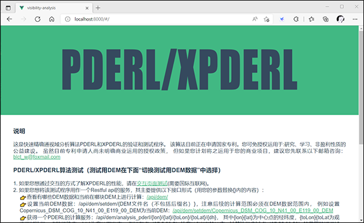
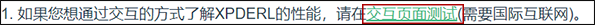
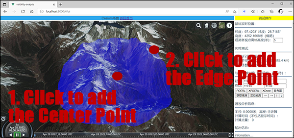
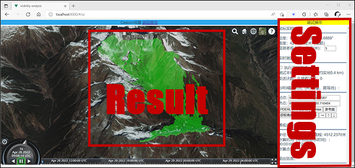
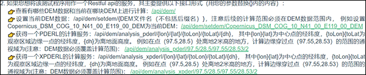
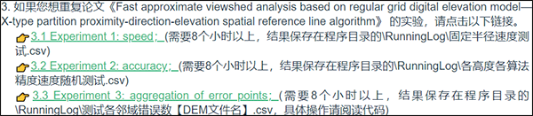

# **PDERL/XPDERL-Algorithm**

> ##Project introduction

This project provides a test program for PDERL and XPDERL algorithms, in the form of Restful WebAPI with a test page.  This project is code in vs2019 with C\# under .net core 2.1. 

Viewshed analysis based on the regular grid digital elevation model (DEM) is one of the basic functions of geographic information systems. Most traditional viewshed analysis algorithms are mainly carried out in a geospatial coordinate system, that create complexities when it is necessary to accurately express a perspective relationship. Moreover, it can only reduce the amount of calculation by using approximation methods, which result in decreased accuracy. Although the error ratio of approximation algorithms is low but uneven and thereby highly likely to result in continuous area visibility errors. Despite the quality of DEM data having improved significantly in the last decade, traditional approximation algorithms have been unable to take full advantage of the improved data.

PDERL and XPDERL establishing a ‘proximity-direction-elevation’ (PDE) coordinate system and  get great improvements in accuracy and speed within it. It has been proved that the accuracy of PDERL is the same as the R3 algorithm and its speed is about half that of the XDraw and reference plane algorithms, much faster than R3. The computational speed of XPDERL is stable at high above the ground, slightly faster than XDraw and slightly slower than the reference plane algorithm; however, at low heights above the ground, it is much faster than both, especially in mountainous areas near the ground.  The XPDERL does not have false negative errors (identifying visible points as non-visible points), and can significantly reduce the error rate and the degree of error point aggregation compare to traditional viewshed analysis algorithms.

See more about PDERL:
Wu, C., Guan, L., Xia, Q. et al. PDERL: an accurate and fast algorithm with a novel perspective on solving the old viewshed analysis problem. Earth Sci Inform 14, 619–632 (2021). https://doi.org/10.1007/s12145-020-00545-7

The algorithm has been submitted for patent application. You may use it without authorization: research, study, non-profit public welfare construction. Although the patent applicant has not yet specified the licensing policy for commercial use, if you plan to apply it to your business project, we strongly recommend you to contact first: blct_w@foxmail.com.

> ##Restore the project

Follow these steps to restore the project. If you don't plan to read the code, you can skip this section. We have a compiled executable ready for you to run directly.

1. This program depends on the framework of .NET Core 2.1. Install the SDK  from here if necessary: [Download .net core 2.1](https://dotnet.microsoft.com/en-us/download/dotnet/2.1).
2. Install Visual Studio 2019 (VS2019) or Visual Studio Code (VSCODE) and deploy C# develop environment if necessary. Get Help with VS2019: [Get Start With Visual Studio](https://visualstudio.microsoft.com/zh-hans/vs/getting-started/). Get Help with VSCODE: [Document for Visual Studio Code](https://code.visualstudio.com/docs). Get help with how to code with C# at: [Learn to code in C#](https://dotnet.microsoft.com/en-us/learntocode). Learn to implement a WebAPI program using.NET Core technology: [Link to microsoft document](https://docs.microsoft.com/en-us/aspnet/core/tutorials/first-web-api?view=aspnetcore-6.0&tabs=visual-studio).
3. Download the zip file of this project and unzip the file. Find the Solution File at [./Code/XPDERL.sln](./Code/XPDERL.sln). Open it in VS2019 or VSCODE.
4. Stay connected to the Internet and wait for automatic resolution and download all necessary dependent files.
5. Start debugging and follow the start page to test.

> ##Run and test

To help those unfamiliar with C# quickly evaluate the performance of PDERL and XPDERL, we provide executables that run on x64 Windows which already contain full dependencies. You just need to **double-click to run it** as the administrator. The file location is: "./Compiled file/win_x64/xpderl.exe". It works just as well as by debugging the code directly. When run the exe or start debug by VS2019, the default url for the start page is [http://localhost:8000/](http://localhost:8000/). You can theoretically access this address on any browser, but for the best experience, we recommend you access it on Edge or Chrome. 

The Start Page looks like:


1. If you want to test the performance of PDERL and XPDERL in an interactive page, please click this link:

The interactive page looks like below. Click on the first point to set the center position, click on the second point to set the edge position to get a blue calculation area.

The results are shown below, with the green area visible at the center. Other experiments can be performed in the test Settings area on the right. However, it should be noted that the calculation range cannot be set too large when comparing with the accuracy of R3 algorithm, otherwise the calculation time will be very long.


2. If you want to use this test program as a Restful API service of viewshed analysis, follow the instructions here:


3. If you would like to repeat the experiment in paper "Fast approximate viewshed analysis based on regular grid digital elevation model——X-type partition proximity-direction-elevation spatial reference line algorithm", please click the link like in the picture below. The results of the experiment are saved in the form of the CSV file in "./RunningLog/". Clicking on the link just starts the experiment, and you must wait for the experiment to complete before completing the evaluation. Please pay attention to whether the size of the report file continues to grow. When it stops growing, it indicates that an experiment has ended. Due to the huge amount of computation, these experiments are very time-consuming, depending on the computer performance, usually more than 6 hours.


> ##About the code

###Modify Network Port
This is a web application, if you want to modify the web port. Find the file [./Code/XPDERL/Program.cs](./Code/XPDERL/Program.cs), modify it in the UseUrls(...): 
```C#
        public static IWebHostBuilder CreateWebHostBuilder(string[] args) =>
            WebHost.CreateDefaultBuilder(args).UseUrls("http://*:8000")
                .UseStartup<Startup>();
```
###The Service Entrance
The api service is code in the [./Code/XPDERL/Controllers/DemController.cs](./Code/XPDERL/Controllers/DemController.cs); All network API are implemented in GET methods. Routing rule: "/api/dem/[declared method routing]", Where "declared method routing" is declared in the parameters of the HttpGet(). Some of the important WebAPIs are:
#####1. Get current DEM and DEM list:
```C#
		[HttpGet]
		public ActionResult<object> Get()
		{
		    ...
		}
```
The result is JSON data:
```json
{
    "current":"Copernicus_DSM_COG_10_N28_00_E097_00_DEM",
    "allFiles":["ASTGTM2_N28E097_dem","Copernicus_DSM_COG_10_N28_00_E097_00_DEM",...]
}
```
#####2. Set current DEM:
```C#
		[HttpGet("setdem/{path}")]
		public ActionResult<bool> SetDem(string path)
		{
		    ...
		}
```
{path} is the DEM file name without a suffix, for example: Copernicus_DSM_COG_10_N41_00_E119_00_DEM. DEM files are placed in [./DEM/](./DEM/). You can place any DEM data in TIFF format in this directory, but please do not delete existing files used for experiments, otherwise you will not be able to repeat the experiments in the paper. DEM files in Tiff format are best recorded on a latitude and longitude grid. If recorded in map projection coordinates, change all subsequent latitude and longitude parameters to projected coordinates. Please restart the program after updating the DEM files.

#####3. PDERL service:
```C#
		[HttpGet("analysis_pderl/{lon}/{lat}/{toLon}/{toLat}/{dh}")]
		public ActionResult<object> GetAnalysisDefault_Pderl(double lon, double lat, double toLon, double toLat, double dh)
		{
		    ...
		}
```
{lon}{lat} is the longitude and latitude of the central point, {toLon}{toLat is the longitude and latitude of a point on the edge of the observation area, and {dh} is the altitude from the ground. The result is JSON data. For example, [http://localhost:8000/api/dem/analysis_pderl/97.5/28.5/97.55/28.53/2](http://localhost:8000/api/dem/analysis_pderl/97.5/28.5/97.55/28.53/2),
you will get the results of PDERL square area analysis with 97.5° N, 28.5° E, 2m above the ground as the observation point, 97.55° N, 28.53° E to the edge point. **Note that the range of the test must not exceed the coverage of the DEM file you set up in the previous step.** The result will be:
```json
{
    "visiblePoints":{
        "hierarchy":
            [97.44195,28.4419441,97.55806,28.4419441,97.55806,28.5580559,97.44195,28.5580559,97.44195,28.4419441],
        "values":[[0,0,0,...],[0,1,0,...],[1,1,0,...],...]
        "x":418,
        "y":418},
    "time":"00:00:00.0163397",
    "allCount":174724
}
    
```
Some of the results have been omitted for readability. "hierarchy" is the top, bottom, left, and right edges of the result.
"Values" is the visibility of each DEM grid point in the calculation area represented by 0 and 1. 0 is not visible, 1 is visible.
"x", "y" are the number of columns and rows in the resulting matrix.
"time" is the calculation of time consumption.
"allCount" is the total number of DEM grid points calculated.

#####4. XPDERL service:
```C#
		[HttpGet("analysis_xpderl/{lon}/{lat}/{toLon}/{toLat}/{dh}")]
		public ActionResult<object> GetAnalysisDefault_xPderl(double lon, double lat, double toLon, double toLat, double dh)
		{
		    ...
		}
```
Parameter meaning and return value are the same as PDERL.

#####5. Experiment 1: speed:
```C#
		[HttpGet("x_analysis_auto_test_time_without_r3")]
		public ActionResult<string> X_DoAnalysis_AutoTest_TimeWithoutR3()
		{
		    ...
		}
```
This will start experiment 1, the results of which will be saved in the CSV report here [./RunningLog/](./RunningLog/). Please wait patiently for the calculation to complete (approximately 6 hours) due to the huge amount of calculation.

#####6. Experiment 2: accuracy:
```C#
		[HttpGet("x_analysis_auto_test_accuracy")]
		public ActionResult<string> X_DoAnalysis_AutoTest_Accuracy()
		{
		    ...
		}
```
This will start experiment 2, the results of which will be saved in the CSV report here [./RunningLog/](./RunningLog/). Please wait patiently for the calculation to complete (approximately 6 hours) due to the huge amount of calculation.

#####7. Experiment 3: aggregation of error points:
```C#
		[HttpGet("x_analysis_auto_test_neighbor_err")]
		public ActionResult<string> X_DoAnalysis_AutoTest_NeighborErr(int p = 0)
		{
		    ...
		}
```
This will start experiment 3, the results of which will be saved in the CSV report here [./RunningLog/](./RunningLog/). "p=1" will test on Copernicus_DSM_COG_10_N41_00_E119_00_DEM.tiff; "p=2" will test on Copernicus_DSM_COG_10_N34_00_E114_00_DEM.tiff; "p=3" will test on Copernicus_DSM_COG_10_N28_00_E097_00_DEM.tiff. **Please note that experiments with different parameters cannot be carried out simultaneously.** Please wait patiently for the calculation to complete (approximately 6 hours) due to the huge amount of calculation.


###The Function Code of PDERL and XPDERL
The main function of PDERL and XPDERL is code in ["./Code/XPDERL/DemAnalysisHandle.cs"](./Code/XPDERL/DemAnalysisHandle.cs);  

#####1. PDERL:
```C#
        public void DoAnalysisByPedrl(double centerX, double centerY, double centerH, double toEndPointX, double toEndPointY, double standH, out int[,] result, out double demMinX, out double demMinY, out double perX, out double perY)
		{
		    ...
		}
```
The "result" matrix stores the analysis results. "demMinX"/"demMinY" is the horizontal/vertical coordinate of a point in the lower left corner of the result. "perX" /"perY" is the horizontal/vertical spacing of the grid.

#####2. XPDERL:
```C#
        public void DoAnalysisByXPderl(double centerX, double centerY, double centerH, double toEndPointX, double toEndPointY, double standH, out int[,] result, out double demMinX, out double demMinY, out double perX, out double perY)
		{
		    ...
		}
```
The parameters have the same meaning as PDERL.
